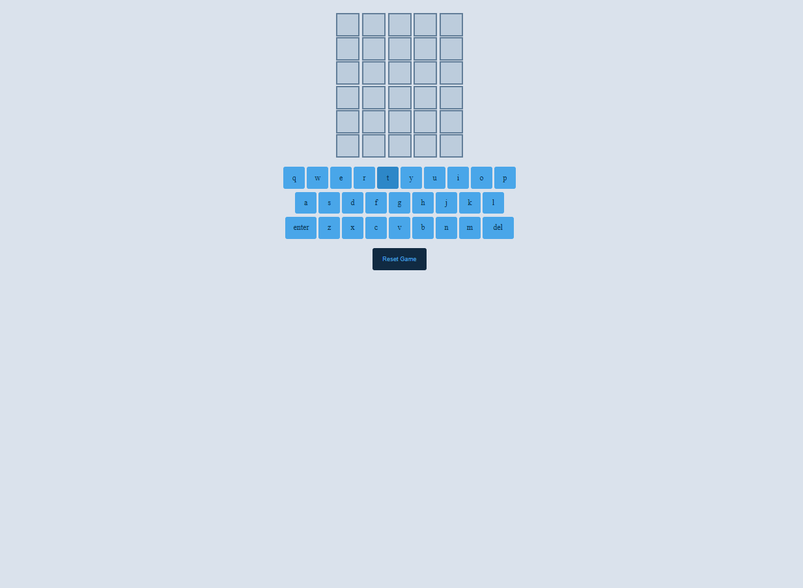

# Word Guess Game

A Wordle clone built with **HTML**, **CSS**, and **JavaScript**.  
This project was created as a learning exercise to practice **vanilla JavaScript** game logic, **DOM manipulation**, and **CSS animations**.

---

## 🌐 Live Demo
[Play on GitHub Pages](https://ibrahim-rezq.github.io/word-guess-game/)

---

## 🖼️ Preview


---

## 🎯 Purpose
This project was developed to practice:
- Building interactive games with **pure vanilla JavaScript**
- Implementing **object-oriented programming** with ES6 classes
- Creating **dynamic UI updates** through DOM manipulation
- Designing **smooth CSS animations** and transitions

The game challenges players to guess a five-letter word in six attempts, with color-coded feedback after each guess — just like Wordle!

---

## 💡 Learning Takeaways
Through this project, I learned to:
- Structure game logic using **ES6 classes** and clean state management
- Work with **array methods** (`map()`, `indexOf()`, `join()`) for game mechanics
- Implement **staggered animations** using `setTimeout()` for visual effects
- Handle **user input validation** and prevent duplicate guesses
- Manage **event listeners** for interactive keyboard functionality

---

## 🧩 Technologies Used
- **HTML5**
- **CSS3**
- **JavaScript (ES6+)**

---

## 🎮 How to Play

1. Click letters on the on-screen keyboard to spell a five-letter word
2. Click **ENTER** to submit your guess (must be 5 letters)
3. Click **DEL** to delete the last letter
4. Use the color-coded feedback to inform your next guess:
   - **🟩 Hot (Green)**: Right letter, right spot
   - **🟨 Cold (Yellow)**: Right letter, wrong spot
   - **⬜ Gray**: Letter not in word
5. You have **6 attempts** to guess the correct word
6. Click **Restart** to play again with a new word

---

## 🚀 Getting Started

1. Clone the repository:
   ```bash
   git clone https://github.com/Ibrahim-Rezq/word-guess-game.git
   ```

2. Open the project folder and launch `index.html` in your browser.

That's all — it's a fully static project, ready to play or customize.

---

## ⚙️ Customization

Feel free to modify this game:

* Add more words to the `words` array in the JavaScript file
* Customize the color scheme in the CSS
* Adjust animation timings for different visual effects
* Add sound effects or a score tracking system

---

## ⚖️ License

This project is shared under the **MIT License** — you are free to use, modify, and distribute it for personal or commercial projects.

---

## 👨‍💻 Author

Created by [Ibrahim Rezq](https://github.com/Ibrahim-Rezq) as part of a front-end learning journey.
